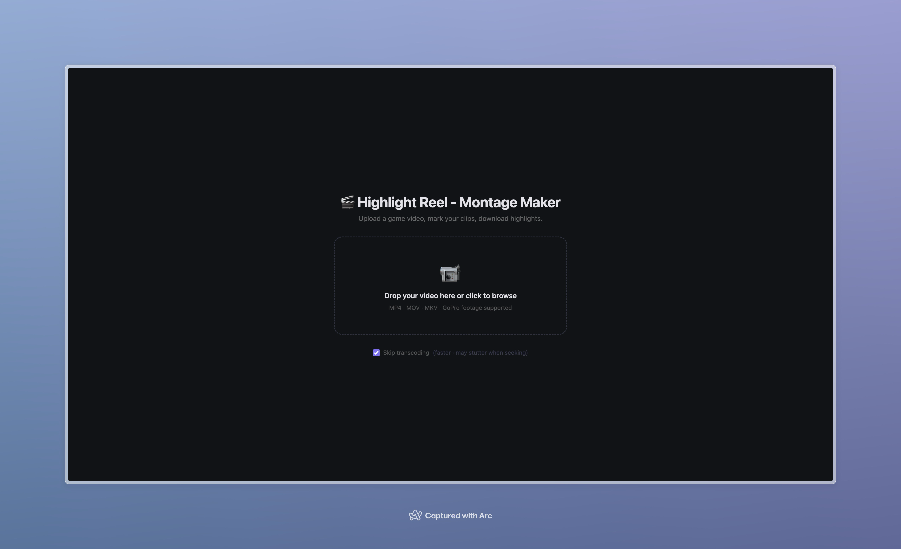

# Highlight Reel - Montage Maker

[](LICENSE)

A local web app for marking goal and save timestamps in ball hockey GoPro videos and generating a highlight montage.



---

## Quick Start (developers)

**Prerequisites:** Python 3.9+ and [FFmpeg](https://ffmpeg.org/) must be installed.

```bash
# Install FFmpeg if you don't have it
# macOS:   brew install ffmpeg
# Windows: winget install Gyan.FFmpeg
# Linux:   sudo apt install ffmpeg

git clone https://github.com/cdeck95/highlight-reel.git
cd highlight-reel
pip install -r requirements.txt
python3 server.py   # then open http://localhost:5001
```

---

## What You Need

- Your game videos in MP4 format
- About 10 minutes for first-time setup
- A Mac **or** a Windows 10/11 laptop

---

## One-Time Setup — macOS

### 1. Install Homebrew (if you don't have it)

Homebrew is a tool that installs software on Mac. Open **Terminal** (press `Cmd + Space`, type "Terminal", press Enter) and paste this:

```
/bin/bash -c "$(curl -fsSL https://raw.githubusercontent.com/Homebrew/install/HEAD/install.sh)"
```

Follow the prompts. It may ask for your Mac password.

### 2. Install FFmpeg

FFmpeg is the video-processing engine used to cut and join clips. In Terminal:

```
brew install ffmpeg
```

This may take a few minutes.

### 3. Install Python 3 (if you don't have it)

Check first:

```
python3 --version
```

If you see a version number (e.g. `Python 3.12.0`), you're good. If not:

```
brew install python
```

### 4. Download this project

Unzip the file you received and note where the folder is (e.g. `~/Downloads/highlight-reel`).

### 5. Install Python dependencies

In Terminal, navigate to the project folder:

```
cd ~/Downloads/highlight-reel
```

Then install the dependencies:

```
pip3 install -r requirements.txt
```

---

## One-Time Setup — Windows

### 1. Open PowerShell

Press `Win + X` and choose **Terminal** or **Windows PowerShell**. All commands below are typed here.

### 2. Install Python 3 (if you don't have it)

Check first:

```
py --version
```

If you see a version number, you're good. If not, download the installer from **https://www.python.org/downloads/** and run it. On the first screen, **check the box that says "Add Python to PATH"** before clicking Install.

### 3. Install FFmpeg

Windows 10 and 11 include `winget`, a built-in package manager. Run:

```
winget install Gyan.FFmpeg
```

When it finishes, **close and reopen PowerShell** so the new command is available. Verify it worked:

```
ffmpeg -version
```

### 4. Download this project

Unzip the file you received and note where the folder is (e.g. `C:\Users\YourName\Downloads\highlight-reel`).

### 5. Install Python dependencies

In PowerShell, navigate to the project folder:

```
cd C:\Users\YourName\Downloads\highlight-reel
```

Then install the dependencies:

```
pip install -r requirements.txt
```

---

## Running the App — macOS

Every time you want to use the tool:

1. Open Terminal
2. Navigate to the project folder:
   ```
   cd ~/Downloads/highlight-reel
   ```
3. Start the server:
   ```
   python3 server.py
   ```
4. Open your browser and go to: **http://localhost:5001**

Keep the Terminal window open while you're using the app. To stop the server when you're done, press `Ctrl + C`.

---

## Running the App — Windows

Every time you want to use the tool:

1. Open PowerShell (`Win + X` → Terminal or PowerShell)
2. Navigate to the project folder:
   ```
   cd C:\Users\YourName\Downloads\highlight-reel
   ```
3. Start the server:
   ```
   py server.py
   ```
4. Open your browser and go to: **http://localhost:5001**

Keep the PowerShell window open while you're using the app. To stop the server when you're done, press `Ctrl + C`.

---

## How to Use


### Upload a video

1. Drag your video file onto the upload area, or click it to browse.
2. **Skip transcoding** is checked by default — leave it on for faster loading. Uncheck it only if the video stutters badly while seeking.
3. Wait for "Ready" to appear. Large files may take a moment.

### Mark clips

Once the video loads, use keyboard shortcuts to navigate and stamp clips:

| Key          | Action                                       |
| ------------ | -------------------------------------------- |
| `Space`      | Play / Pause (also click the video directly) |
| `←`          | Back 5 seconds                               |
| `→`          | Forward 10 seconds                           |
| `G`          | Stamp a **goal** clip at current time        |
| `S`          | Stamp a **save** clip at current time        |
| `P`          | Cycle playback speed (1× → 1.5× → 2× → 0.5×) |
| Hold `Space` | Slow motion (0.25×) while held               |

Click any timestamp in the list to jump to it, or click the `×` next to a timestamp to remove it.

Goal clips are shown with a purple badge; save clips with a blue badge.

### Add another video

Click **+ Add Video** in the tab bar to upload additional videos (e.g. a second period or a different game). Clips are tracked separately per video. Background uploads show progress in the tab label so you can keep working without waiting.

### Session auto-save

Your timestamps are saved automatically as you work. If you close the tab or refresh the page, a **Resume** button will appear on the upload screen so you can pick up where you left off.

### Reorder clips

By default, clips are assembled in the order they appear in each video. To change the order — for example, to interleave clips from different videos — click **⠿ Reorder Clips** in the sidebar footer. Drag items into the desired order, then click **Done**. A "Custom order" indicator appears when a custom order is active. Click **Reset** to restore the default order.

### Generate the montage

Once you've marked all your clips, click **Generate Montage**. The app will:

1. Extract a clip around each timestamp using the configured pre-roll and post-roll durations
2. Join all clips in order using the selected transition (hard cut or crossfade)
3. Give you a download link when it's done

Clips are pre-extracted in the background as you stamp them, so generation is usually very fast. The montage is saved as an MP4 file.

### Clip settings

In the sidebar footer, the **Clip Settings** panel lets you customise timing and transitions before generating:

| Setting    | Default         | Description                                                  |
| ---------- | --------------- | ------------------------------------------------------------ |
| Pre-roll   | 4.5 s           | Seconds before the timestamp to start the clip               |
| Post-roll  | 2.5 s           | Seconds after the timestamp to end the clip                  |
| Transition | Crossfade 0.5 s | How clips are joined — hard cut or crossfade (0.3 s – 2.0 s) |

Changing pre-roll or post-roll after stamping clips will automatically re-extract clips in the background.

---

## Troubleshooting

**The page won't load at http://localhost:5001**
Make sure the server is still running in Terminal / PowerShell and you haven't closed that window.

**"FFmpeg not found" error**

- macOS: Run `brew install ffmpeg` in Terminal, then restart the server.
- Windows: Run `winget install Gyan.FFmpeg` in PowerShell, then close and reopen PowerShell, then restart the server.

**Video won't play / shows an error in the browser**
Try unchecking **Skip transcoding** and re-uploading the file.

**Montage generation seems stuck**
Check the Terminal / PowerShell window for error messages. Make sure you have enough free disk space (videos can be several GB).

**Windows: `py` command not found**
Python wasn't added to PATH during installation. Re-run the Python installer, click **Modify**, and check the **"Add Python to environment variables"** box.
